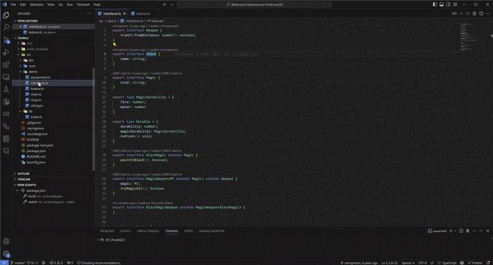
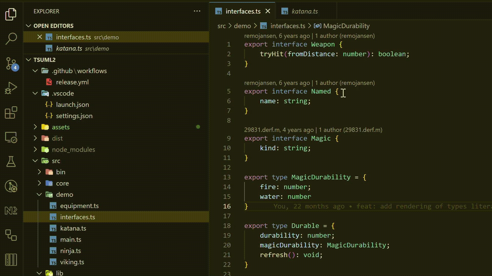
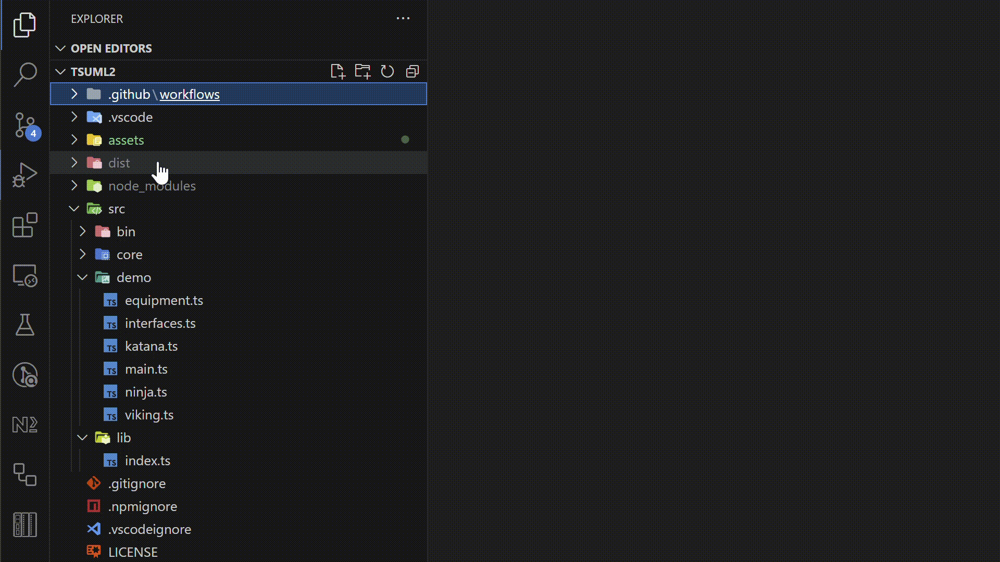

# tsuml2-vscode README

Generate UML diagram for your TypeScript applications.
And view them directly in VS Code - powered by [nomnoml](https://nomnoml.com/).

## Features

TsUML2 works offline, so no third party servers are involved. It supports
- classes
- interfaces
- enums
- types

### Class diagrams for single files

### Class diagrams for a folder

### Class diagrams for multiple files and/or folders

### Navigate to defintions

### Export to Mermaid and nomnoml DSL
You can export a class diagram to [Mermaid](https://mermaid.js.org/) and
[nomnoml](https://nomnoml.com/) language.

> This is pretty handy for embedding (interactive) diagrams directly into markdown.
(i.e.: [embedding diagrams in github markdown](https://docs.github.com/en/get-started/writing-on-github/working-with-advanced-formatting/creating-diagrams#creating-mermaid-diagrams) )

Use it for further refinement of class diagrams in the mermaid / nomnoml editors.

<!--
## Requirements

If you have any requirements or dependencies, add a section describing those and how to install and configure them.
-->

## Extension Settings

<!--
Include if your extension adds any VS Code settings through the `contributes.configuration` extension point.

For example:

This extension contributes the following settings:

* `myExtension.enable`: Enable/disable this extension.
* `myExtension.thing`: Set to `blah` to do something.
-->

<!--
## Known Issues

Calling out known issues can help limit users opening duplicate issues against your extension.
-->

## Release Notes

### 1.0.0

Initial release of TsUML2-vscode

<!--
---

## Following extension guidelines

Ensure that you've read through the extensions guidelines and follow the best practices for creating your extension.

* [Extension Guidelines](https://code.visualstudio.com/api/references/extension-guidelines)

## Working with Markdown

You can author your README using Visual Studio Code. Here are some useful editor keyboard shortcuts:

* Split the editor (`Cmd+\` on macOS or `Ctrl+\` on Windows and Linux).
* Toggle preview (`Shift+Cmd+V` on macOS or `Shift+Ctrl+V` on Windows and Linux).
* Press `Ctrl+Space` (Windows, Linux, macOS) to see a list of Markdown snippets.

## For more information

* [Visual Studio Code's Markdown Support](http://code.visualstudio.com/docs/languages/markdown)
* [Markdown Syntax Reference](https://help.github.com/articles/markdown-basics/)

**Enjoy!**
-->
